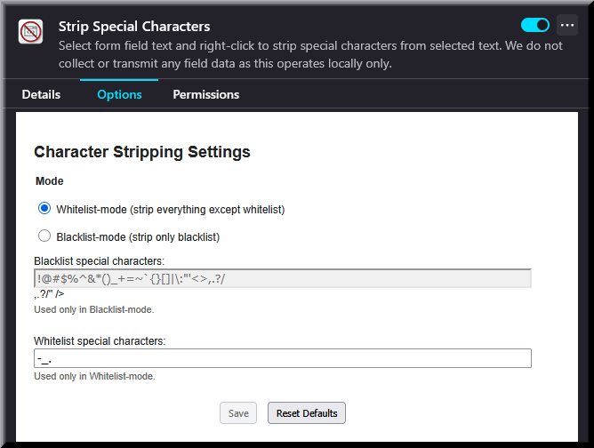

# Strip Special Characters

A lightweight Firefox extension that lets you right-click selected text in any editable field and remove unwanted characters using either **Whitelist-mode** (keep only these) or **Blacklist-mode** (remove only these).

  

---

## Features

- **Context-menu action**
  Right-click in an input, textarea, or content-editable area and choose **Strip special characters** (or use the keyboard shortcut).
- **Whitelist-mode**
  Strip everything except alphanumeric characters (A–Z, a–z, 0–9), spaces, and your custom whitelist.
- **Blacklist-mode**
  Remove only the characters you specify; everything else is preserved.
- **Dirty-state feedback**
  Save button is disabled until you make changes, then becomes **Save Changes** in green to highlight unsaved edits.
- **Keyboard shortcut**
  Default: `Ctrl+Shift+Y` (`⌘+Shift+Y` on macOS).  
  You can rebind it via **about:addons → Manage Extension Shortcuts**.
- **Persistent settings**
  Your mode, blacklist, and whitelist are saved locally.
- **Privacy-first**
  Operates entirely in your browser—no data is collected or transmitted.

---

## Requirements

- Firefox 91 or later

---

## Installation (Developer)

1. **Clone or download** this repository.
2. Open **about:debugging** in Firefox and select **This Firefox**.
3. Click **Load Temporary Add-on…**, then choose `manifest.json`.
4. The extension will appear in your toolbar and context menu.

_For permanent install and publishing, see [Publishing on AMO](#publishing-on-amo)._ 

---

## Usage

  

1. Select text in any form field.
2. Right-click → **Strip special characters** (or press your shortcut).
3. Depending on your mode:
   - **Whitelist-mode**: all non-alphanumerics except your whitelist are removed.
   - **Blacklist-mode**: only your blacklisted characters are removed.
4. The cleaned text replaces your selection.

---

## Options

Open **about:addons → Strip Special Characters → Options**, or click the gear icon on the toolbar entry to configure:

1. **Mode**
   - **Whitelist-mode** (default)
   - **Blacklist-mode**
2. **Whitelist special characters**
   Enter characters you want to keep (Whitelist-mode only).
3. **Blacklist special characters**
   Enter characters you want to strip (Blacklist-mode only).
4. **Save / Reset Defaults**
   - **Save** is disabled until you make changes; then becomes **Save Changes** in green.
   - **Reset Defaults** restores the built-in lists and mode.

---

## Publishing on AMO

1. Prepare and zip your extension files (including `icons/`, `manifest.json`, `background.js`, `options.html`, `options.js`).
2. Create a developer account at [addons.mozilla.org/developers](https://addons.mozilla.org/developers).
3. Submit a new add-on, upload the ZIP, and fill in metadata:
   - **Name**: Strip Special Characters
   - **Summary**: Right-click to strip characters per your whitelist or blacklist.
   - **Tags**: form-tools, text-cleanup, context-menu
4. Agree to the MIT License, then publish.

---

## Contributing & Support

Found a bug or want a feature? Please open an issue or pull request at:

https://github.com/YourUser/strip-special-chars/issues

---

## License

This project is licensed under the [MIT License](https://opensource.org/licenses/MIT).
